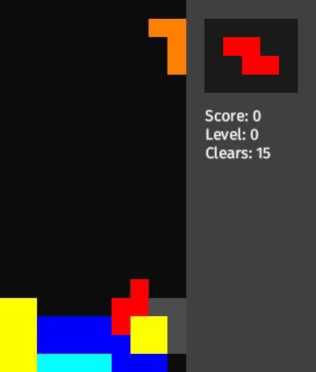
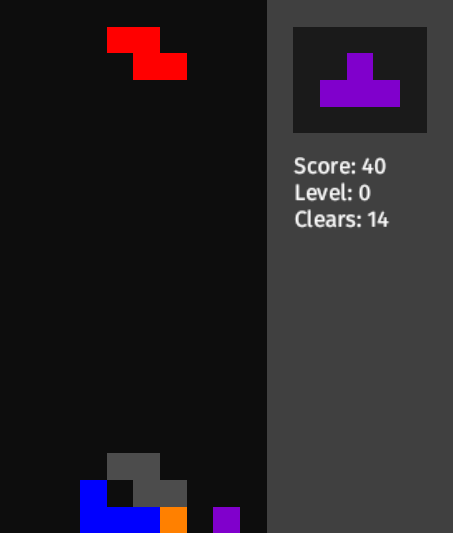

## Tetris clone made in Rust

### Running
`$ git clone https://github.com/nicey0/tetris-clone.git`

`$ cd tetris-clone`

`$ cargo run`

### Installation
No

### Files
- colpoint.rs
    - ColPoint structure: holds a static (placed) block
- conf.rs
    - App configuration (colors, cell size, ...). Can be changed to whatever you'd like
- game.rs
    - Game structure and mainloop
- key.rs
    - Key processing
- main.rs
    - main.rs
- piece_defs.rs
    - Piece constructor functions
- pieces.rs
    - Piece structure definition
- render.rs
    - Rendering
- shadow.rs
    - Shadow structure
- update.rs
    - Updating
- util.rs
    - Utility stuff

### Screenshots

